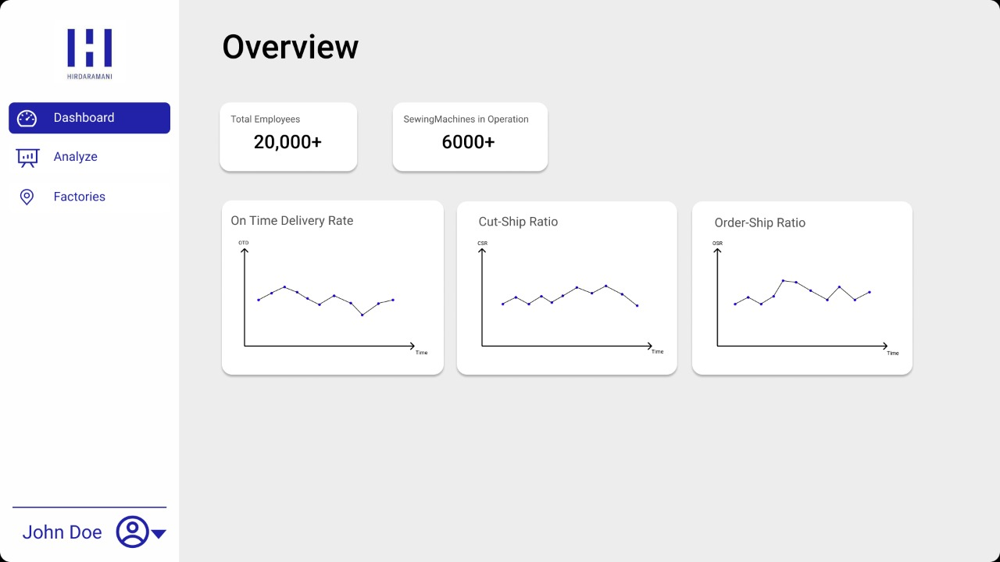
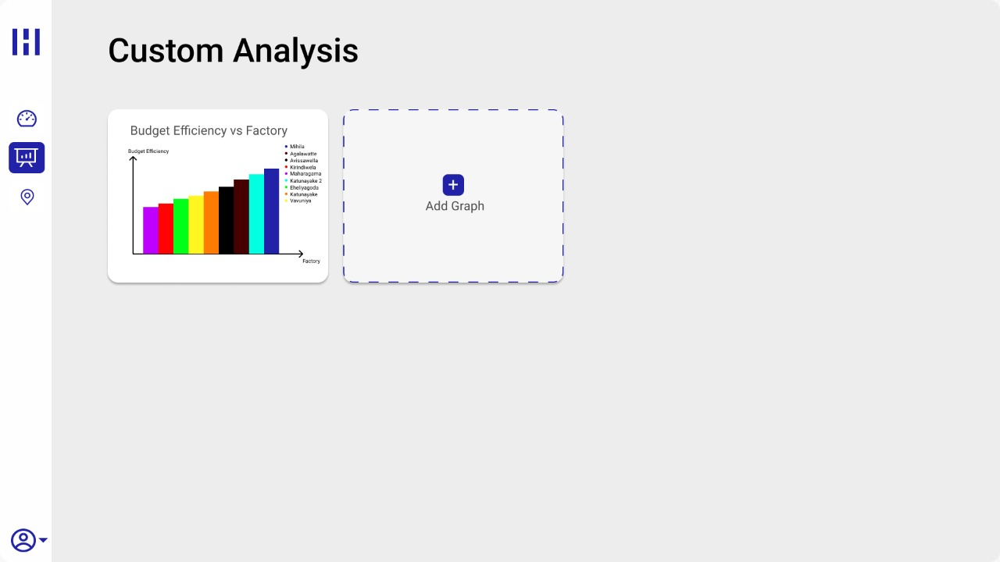
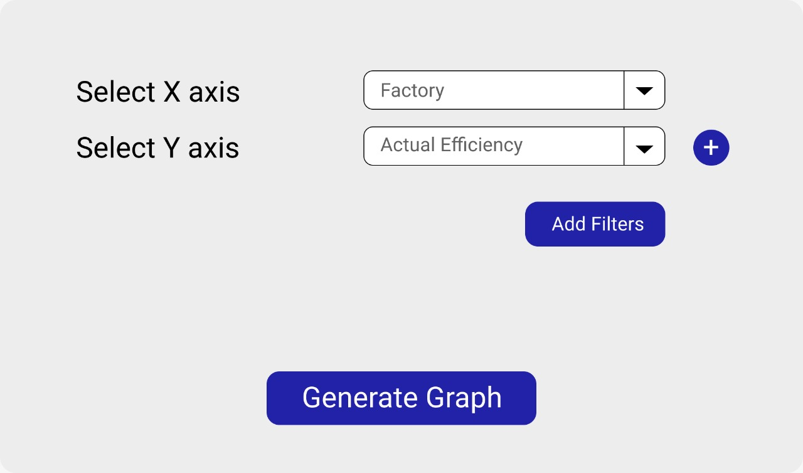
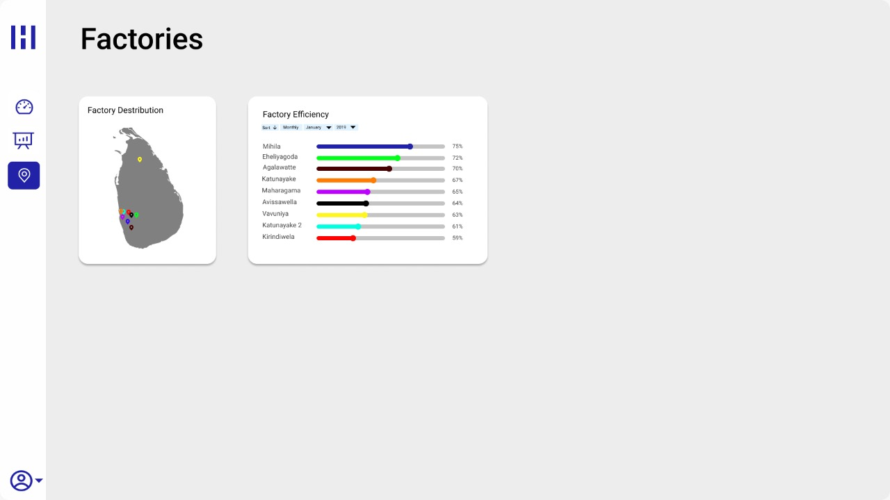

[comment]: # "This is the standard layout for the project, but you can clean this and use your own template"

# AiPaS - Apparel Industry Performance Analysis Software

---

## Team

- E/17/134, Kavindu Jayasooriya, [email](mailto:e17134@eng.pdn.ac.lk)
- E/17/207, Pasindu Marasinghe, [email](mailto:e17207@eng.pdn.ac.lk)
- E/17/318, Udith Senanayake, [email](mailto:e17318@eng.pdn.ac.lk)

## Table of Contents

1. [Introduction](#introduction)
2. [Problem](#problem)
3. [Proposed Solution](#proposed-solution)
4. [High Level Solution Architecture](#high-level-solution-architecture)
5. [Data Flow](#data-flow)
6. [UI Designs](#ui-designs)
7. [Supervisors](#supervisors)
8. [Links](#links)

---

## Introduction

The second-largest source of income in Sri Lanka is the apparel industry. While lots of companies in this industry are gradually adopting new technologies like smart quality management systems, even some of the largest companies in Sri Lanka are still taking a very traditional approach in their product management. Even the slightest improvement in the efficiency and reliability of this process with seamless integration of new technologies like Big Data and ML could go a long way in strengthening the Sri Lankan economy. There is no better place than Hirdaramani Apparel, the third largest and the oldest apparel exporter in Sri Lanka, to take a big step in this direction. The possibility to make a contribution to such a shift is thrilling, especially with a project that has virtually no cost, yet promising results.

## Problem
- There are KPIs in the apparel industry such as Cut-to-ship ratio, On-Time Delivery rate, Man to machine ratio, average style changes over time, etc.
- The problem we are trying to solve is the issues in achieving on-time delivery.
- Weaknesses in current practice:
  * Unreliable prediction of delivery
  * Unpredictable delivery of raw materials
  * Traditional/manual analysis and planning - (e.g.: excel sheets)
  * No user-friendly system to visualize and understand the data
  * Data from past orders are not properly used for the future (short term analysis)

## Proposed Solution
To develop an application that allows the user to load datasets and see meaningful information and visualizations in an easy-to-understand manner. Administrators will be able to pay attention to the underlying causes of low OTD by identifying them with the application. Furthermore, it can predict the OTD based on the fields involved.

- An application to input data sets and get outputs/visualizations
- To determine the causes of low OTD
- To predict the OTD based on the fields involved

The business value of the solution
- The level of customer satisfaction
- Improve the stability of the process
- Early detection of problems

How is the solution better than the existing one?
- Data analysis - ML-based analysis is faster, more accurate, reliable than traditional approaches.
- The accuracy of the prediction models is measurable.
- The expected users of the application are the Administration and the Management staff, hence the solution should consist of an easy-to-use user interface with easily interpretable outputs/visualizations of data analysis and prediction.

## High Level Solution Architecture

### Frontend
The front end of the application lets the user to

- Add data on any type of files (xlsx, csv, tsv, etc.)
- Obtain visualizations of data analytics and predictions.

### Backend
The backend of the application

- Preprocesses, validates the data
- Trains and Make predictions from the machine learning model
- Communicates with the database to store, retrieve data when required
- The frontend communicates with the backend through an API. It

Passes the raw data in the files to the backend.
Obtains data necessary for visualizations.

## Data Flow

### Data input
The input data file is first parsed and stored in our data structure. That way, we can switch between various input files without propagating that change into the other components in our system.
For example, if the client requirements change for the input file from an excel file to a CSV file. Then, it can be implemented easily by replacing the parser with a suitable implementation.

### Processing
The data is stored to make our system stateful by avoiding repetitive uploads of the same file.
Next in the data pipeline is the machine learning model. That consists of both the model training and predicting components. The machine learning model is implemented in a modular way to achieve low coupling.

### Representing
The predicted and input data can be visualized in the user interface. At this stage of the data pipeline, we use a cache for storing predicted data in the front-end to provide faster loading times for the user.

## UI Designs

.....
## Supervisors

- Dr. Asitha Bandaranayake [Web Page](http://www.ce.pdn.ac.lk/academic-staff/asitha-bandaranayake/)
- Dr. C.D. Senanayake [Web Page](https://mie.pdn.ac.lk/staff/DrCDSenanayake.html)

## Links

- [Project Repository](https://github.com/cepdnaclk/e17-co328-apparel-industry-performance-analyser/)
- [Project Page](https://github.com/cepdnaclk/e17-co328-apparel-industry-performance-analyser)
- [Department of Computer Engineering](http://www.ce.pdn.ac.lk/)
- [University of Peradeniya](https://eng.pdn.ac.lk/)

[//]: # (Please refer this to learn more about Markdown syntax)
[//]: # (https://github.com/adam-p/markdown-here/wiki/Markdown-Cheatsheet)
